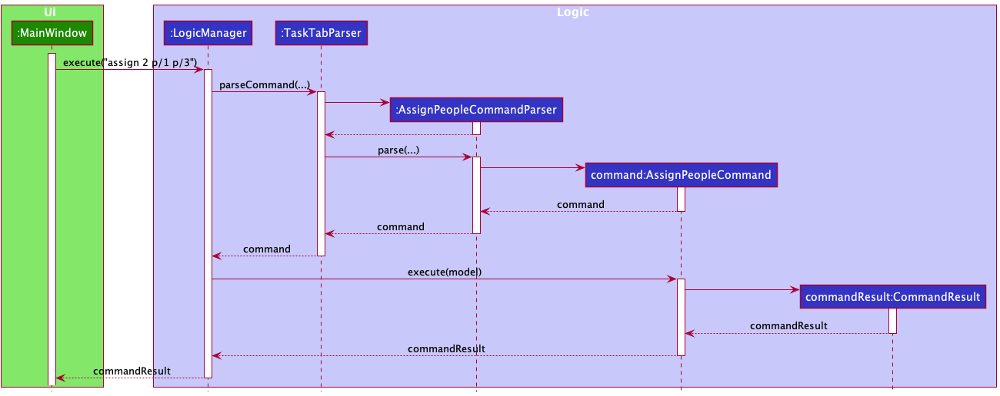

### Project: Dash

Dash is a desktop application that acts as a Dashboard for managing your contacts and tasks.
Dash operates using a CLI (Command Line Interface) but has a GUI made with JavaFX.
It is written in Java, and has about 11 kLoC.

Given below are my contributions to the project.

* **Code contributed**: [RepoSense link](https://nus-cs2103-ay2122s1.github.io/tp-dashboard/#breakdown=true&search=zenlzb)

* **Project management**:
  - Team Lead
  
    - Responsible for delegation of tasks and general direction of the project.
    - Managed the issue tracker on the team repo
  
      - Created issues to keep track of todos
      - Categorised issues in terms of category and severity
  
    - Managed Releases
  
      - Created releases for every version
      - Manually tested jar files before releases

* **New Features**:
  - Adapted various Contacts features to work on Tasks  
    
    - Adapted AddressBookParser into TaskTabParser to parse commands on the task tab.
    - Adapted ClearPersonCommand and DeletePersonCommand into task versions.
  
  - Implemented Assigning people to tasks
  
    - A task can be assigned people from the contacts list similar to how it can be assigned tags.

  - Implemented Assign and Tag commands
    
    - A person can have multiple tags, a task can have multiple tags and multiple
  people assigned to it.
    - Using edit to update tags or people overwrites all the existing tags and people.
    - Assign and tag commands allow you to add additional tags and/or people without removing
  the old ones

* **Enhancements to existing features**:
  - Updated contacts such that only name is a required field, making adding contacts an
  easier process

* **Documentation**:
  * User Guide:   
    
    - Added command descriptions for many new commands  
    
    Example Extract:
>    
>Editing task details: [edit]  
Replaces the details of the task at the given index with the new details.
>
>Format: edit INDEX [d/DESCRIPTION] [dt/DATE] [dt/TIME] [dt/DATE, TIME] [p/PERSON INDEX]... [t/TAG]...
>
>- Edits the specified task fields at the specified INDEX
>- The index refers to the index number shown in the task list
>- The index must be a positive integer i.e. 1, 2, 3, …
>- At least one of the optional fields must be provided.
>- Existing values will be updated to the input values.
>- When editing tags, the existing tags of the task will be removed i.e adding of tags is not cumulative.
>- You can remove all the task’s tags by typing t/ without specifying any tags after it.
>- An explanation of how Date and Time formats work can be found here
>- Assigning people to a task uses the current index of the person on the contacts list, which is shown on the side bar to the right.
>
>Tagging a task: [tag]  
Adds extra tags to a task without wiping the old tags.
>
>Format: tag [t/TAG]...
>
>Assigning people to a task: [assign]  
Assigns extra people to a task without wiping people already assigned.
>
>Format: assign [p/PERSON INDEX]...
>
>Assigning people to a task uses the current index of the person on the contacts list, which is shown on the side bar to the right.
  
  * Developer Guide:

    - Added implementations details of assigning people to tasks
    - Updated implementation of logic section  
    Example Extract:
> We integrated the existing address book system of storing contacts with our new task list system by adding the ability
>      to assign people from your address book to tasks in your task list.   
>      Possible use cases:
>- Assigning group members to group tasks to keep track of who to contact.
>- Assigning people who have RSVPed to a gathering to keep track of who is attending.
>- Assigning which prof to email after completing a piece of work.
>
>#### Implementation
>In the `Task.java` class, `people` is a Set of `Person` objects that represents a task being assigned people, similar to
`tags`. A user can assign people to a task in 2 ways:
>- The `assign` command, which adds more `Person` objects to the existing `people` set.
>- The `edit` command, which replaces the existing `people` set with a new one.
>
>The `Person` objects are assigned to a task using the relevant index currently being displayed on the filtered person
list. All indices that represent people are preceded with the `p/` prefix. We added the side panel on the tasks tab
so that it would be easier to see the list of contacts to assign people to tasks, instead of needing to switch tabs
back and forth when assigning people.
Example usage of either command is as follows:
>- `assign 2 p/1 p/3` - Assigns persons 1 and 3 to task 2.
>- `edit 2 p/1 p/3` - Replaces task 2's set of people with a set consisting of persons 1 and 3.
>
>A sequence diagram is provided below:

>
>#### Challenges
>
>This was the first set of commands that required access to the address book, so implementing the parser for the
commands simply by implementing the `Parser` interface was not sufficient. An extension to the `Parser`
interface, `ParserRequiringPersonList` was created for these commands specifically, and an alternative parse function
was created which took in the person list from the command parser `TaskTabParser`.
>
>#### Alternatives Considered
>
>- Assigning people using their names instead of index
>
>Pros: No need to remember indices  
Cons: Too much of a hassle with long names, and using only parts of a name was not feasible due to
the possibility of multiple people with the same first name, etc. The side panel was implemented to circumvent
this problem

* **Community**:
  * PRs reviewed (with non-trivial review comments): [\#183](https://github.com/AY2122S1-CS2103T-W15-2/tp/pull/183)
  * Reported bugs and suggestions for other teams in the class (examples: 
    [1](https://github.com/AY2122S1-CS2103T-T17-2/tp/issues/160), [2](https://github.com/AY2122S1-CS2103T-T17-2/tp/issues/155),
    [3](https://github.com/AY2122S1-CS2103T-T17-2/tp/issues/174))

